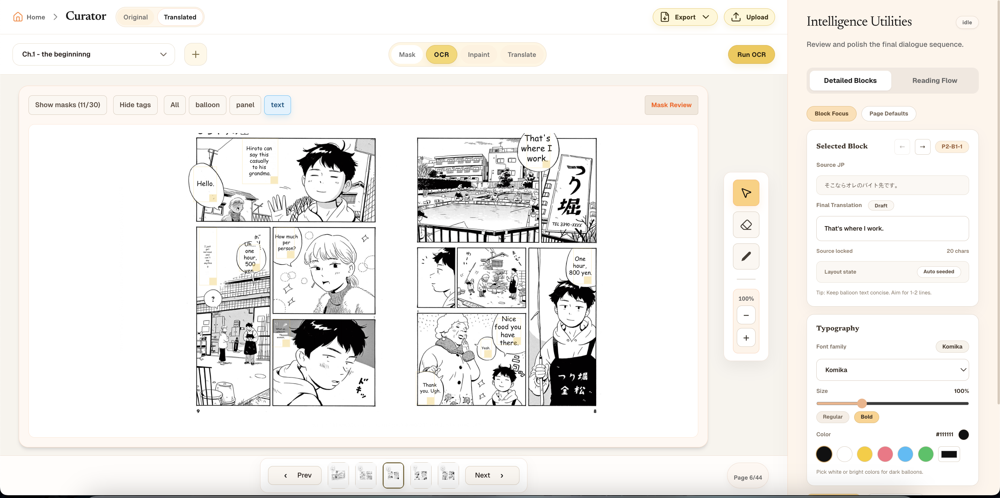

# CuratorML

[](./LICENSE)
[](https://docs.docker.com/compose/)
[](https://fastapi.tiangolo.com/)
[](https://react.dev/)
[](https://www.postgresql.org/)

CuratorML is a local-first manga translation workspace for turning scanned manga pages into editable translation projects.

It combines a React editor, a FastAPI backend, PostgreSQL/pgvector storage, local OCR, YOLO segmentation-assisted masking, OpenCV-based cleanup/inpainting, translation memory, and export workflows for downstream editing.

The project is designed for supervised manga translation: a human translator stays in control while ML tools handle repetitive page preparation tasks such as region detection, OCR, reading-order support, mask cleanup, translation suggestions, and export packaging.

It is also meant to evolve toward collaborative workflows: multi-user review, shared project access, and support for more ML models and providers without forcing the whole app into one rigid pipeline.

## Table of contents

- [Why CuratorML exists](#why-curatorml-exists)
- [What it does](#what-it-does)
- [How it works](#how-it-works)
- [Architecture](#architecture)
- [Features](#features)
- [Tech stack](#tech-stack)
- [Repository layout](#repository-layout)
- [Requirements](#requirements)
- [Quick start](#quick-start)
- [Deployment](#deployment)
- [Development](#development)
- [Configuration](#configuration)
- [Tests and quality checks](#tests-and-quality-checks)
- [Data and model policy](#data-and-model-policy)
- [Related work and acknowledgements](#related-work-and-acknowledgements)
- [Troubleshooting](#troubleshooting)
- [License](#license)

## Why CuratorML exists

Manga translation is a messy human workflow.

You need to track pages, keep terminology consistent, inspect OCR results, clean speech bubbles and dialogue regions, and coordinate revisions without losing the source image or the translation context. CuratorML is built around that reality.

Instead of trying to replace the translator, it gives the translator a better workspace:

- project and page management
- machine-assisted detection and OCR
- translation memory for consistency
- layered export artifacts for downstream editing
- a deployment setup that is realistic to run locally

## What it does

- Creates manga translation projects and chapters.
- Uploads page images into a persistent project workspace.
- Detects manga page regions with a YOLO segmentation model.
- Runs OCR through local Manga OCR ONNX assets.
- Supports reading-order and text-region workflows.
- Cleans masked text areas with traditional OpenCV-based cleanup and inpainting for editing.
- Stores translation memory for consistency across pages.
- Streams long-running job progress from the backend to the UI.
- Exports edited results and layered PSD artifacts for downstream editing.
- Runs the web app locally with Docker Compose, with an optional host-side ML inference service for auto-detection.
- Can optionally talk to a local OpenAI-compatible LLM provider such as Docker Model Runner.

## How it works

CuratorML is split into three runtime layers:

1. The Docker Compose app stack runs PostgreSQL/pgvector, the FastAPI backend, and the React frontend.
2. A separate host inference service performs YOLO segmentation and OCR-assisted page analysis.
3. An optional OpenAI-compatible LLM endpoint handles translation or embedding requests.

Typical flow:

1. You create a project and upload manga pages.
2. The backend stores project metadata and page assets.
3. The inference service detects regions and produces masks or page analysis.
4. OCR extracts text from page regions.
5. The editor applies cleanup/inpainting to masked areas using traditional image processing.
6. Translation memory keeps terminology and style consistent across pages.
7. Export jobs package the final results for downstream editing.

Important note: the downloadable `.pt` file in this repo is only the YOLO segmentation model. Cleanup/inpainting is not a separate learned model here; it is traditional OpenCV/mask processing.

## Architecture

```text
Browser
  ↓
React/Vite frontend
  ↓
FastAPI backend
  ├─ PostgreSQL + pgvector
  ├─ translation memory
  ├─ project/page/job APIs
  └─ remote inference dispatch
        ↓
Host Python inference service
  ├─ YOLO segmentation
  ├─ OCR asset loading
  └─ page/mask generation
```

Optional translation path:

```text
Backend → OpenAI-compatible local or remote provider
        → Docker Model Runner or another compatible API
```

## Features

- Project/chapter/page management
- Page upload and persistent storage
- YOLO-based detection for manga regions
- OCR pipeline using local ONNX assets
- Translation memory with vector search support
- Job progress streaming for long-running tasks
- Export pipeline for downstream editing workflows
- Docker Compose deployment for the web stack
- Host-side inference for heavy ML dependencies
- Optional local LLM support through an OpenAI-compatible endpoint

## Screenshots

The UI is designed to be understandable at a glance: page canvas in the center, editing controls on the right, and workflow actions across the top.



## Tech stack

- Frontend: React, TypeScript, Vite, Tailwind CSS, Zustand, React Query
- Backend: FastAPI, SQLAlchemy async, Alembic, Pydantic, Uvicorn
- Database: PostgreSQL with pgvector
- ML/OCR: YOLO segmentation model, manga-ocr-2025 ONNX assets, OpenCV, ONNX Runtime
- Translation gateway: optional OpenAI-compatible endpoint; Docker Model Runner is supported
- Deployment: Docker Compose for the web stack, local Python service for ML inference

## Repository layout

```text
.
├── backend/                 # FastAPI API, services, models, migrations, tests
├── frontend/                # React/Vite user interface
├── scripts/                 # setup, model download, and inference startup scripts
├── docs/                    # architecture and deployment notes
├── docker-compose.yml       # PostgreSQL, backend, and frontend services
├── .env.example             # safe local configuration template
└── README.md
```

For deeper detail, see:

- [`docs/architecture.md`](docs/architecture.md)
- [`docs/deployment.md`](docs/deployment.md)

## Requirements

- Docker and Docker Compose
- Python 3.10+ for the host ML inference service
- curl
- Node.js 20+ if running the frontend outside Docker
- Optional OpenAI-compatible LLM endpoint if using translation features, such as Docker Model Runner on Docker Desktop

On macOS, Docker Desktop is the easiest way to run the containerized services.

## Quick start

### Fastest path: one command

```bash
bash scripts/setup.sh
```

This does the following:

- creates `.env` if it does not exist
- checks the local environment
- downloads required model files
- starts the host inference service
- builds and starts the Docker Compose stack
- opens the frontend on macOS

### Manual start

If you want to run the pieces yourself:

```bash
cp .env.example .env
bash scripts/download-models.sh
bash scripts/start-inference.sh

docker compose build
docker compose up -d
```

### What the manual path does

- `scripts/download-models.sh` fetches the default YOLO segmentation weights from Hugging Face and the OCR assets.
- `scripts/start-inference.sh` starts the ML inference API on the host.
- `docker compose up -d` starts PostgreSQL, the backend, and the frontend.

The default YOLO source is:

```text
https://huggingface.co/ShadowB/Manga109-panel-balloon-text-yolov26-segmentation/resolve/main/best.pt?download=1
```

The script stores it at:

```text
backend/app/services/ml/best.pt
```

If you need another direct download URL, override:

```bash
YOLO_MODEL_URL="https://example.com/direct/best.pt" bash scripts/download-models.sh
```

`INPAINT_MODEL_URL` is still accepted as a deprecated alias for existing setups, but the file is used only for YOLO segmentation.

## Deployment

CuratorML is currently packaged as a self-hosted Docker Compose deployment.

The recommended deployment split is:

- Docker Compose: PostgreSQL, backend API, frontend
- Host service: ML inference
- Optional external provider: translation / embeddings

### Containerized deployment

The Compose stack runs on a single machine and binds the frontend on port `8081`.

Typical commands:

```bash
docker compose build
docker compose up -d
docker compose ps
```

### Host inference service

The ML inference API runs separately on the host by default and binds to `127.0.0.1:8001`.

```bash
bash scripts/start-inference.sh
```

Health endpoint:

```text
http://localhost:8001/health
```

Inference endpoint:

```text
http://localhost:8001/infer/mask_inference
```

If you need Docker to reach the host service, the Docker backend uses:

```text
http://host.docker.internal:8001
```

### Optional local LLM provider

CuratorML supports OpenAI-compatible translation endpoints.

Docker Desktop Model Runner is the documented local option for containers:

- container endpoint: `http://model-runner.docker.internal/engines/v1`
- host endpoint: `http://localhost:12434/engines/v1`

Example `.env` settings:

```env
TRANSLATION_PROVIDER_MODE=compatible_local
TRANSLATION_BASE_URL=http://model-runner.docker.internal/engines/v1
TRANSLATION_MODEL=<docker-model-id>
TRANSLATION_MEMORY_EMBEDDING_BASE_URL=http://model-runner.docker.internal/engines/v1
TRANSLATION_MEMORY_EMBEDDING_MODEL=<embedding-model-id-if-used>
LLM_INFERENCE_BASE_URL=http://model-runner.docker.internal/engines/v1
```

If you use a different OpenAI-compatible provider, update the base URLs and API keys accordingly.

### Public deployment notes

If you expose the app publicly:

- keep port `8001` private
- terminate TLS at a reverse proxy such as Caddy, Nginx, or Traefik
- use a strong `POSTGRES_PASSWORD`
- keep `.env` out of Git
- do not commit model weights or uploaded page images

## Development

### Backend development

```bash
cd backend
python3 -m venv .venv
source .venv/bin/activate
pip install -r requirements.txt -r requirements-dev.txt
npm ci
uvicorn app.main:app --reload
```

`npm ci` in `backend/` installs the Node-side PSD writer dependencies used by layered PSD export.

### Frontend development

```bash
cd frontend
npm install
npm run dev
```

Default Vite dev server:

```text
http://localhost:5173
```

## Configuration

Important environment variables:

| Variable | Purpose |
| --- | --- |
| `DATABASE_URL` | Async PostgreSQL connection string used by FastAPI |
| `POSTGRES_DB` | PostgreSQL database name used by Docker Compose |
| `POSTGRES_USER` | PostgreSQL user used by Docker Compose |
| `POSTGRES_PASSWORD` | PostgreSQL password used by Docker Compose |
| `STORAGE_ROOT` | Backend file storage path |
| `CORS_ORIGINS` | Comma-separated list of allowed frontend origins |
| `INFERENCE_MODE` | `remote` for host inference service, `local` for in-process inference |
| `INFERENCE_REMOTE_URL` | URL of the inference service, default `http://host.docker.internal:8001` in Docker |
| `INFERENCE_HOST` | Host interface used by `scripts/start-inference.sh`; defaults to `127.0.0.1` |
| `INFERENCE_PORT` | Port used by `scripts/start-inference.sh`; defaults to `8001` |
| `INFERENCE_RELOAD` | Opt-in reload mode for `scripts/start-inference.sh`; defaults to `false` |
| `YOLO_MODEL_PATH` | Local YOLO weights path used by the inference service; defaults to `backend/app/services/ml/best.pt` |
| `YOLO_MODEL_URL` | Optional direct URL for `scripts/download-models.sh` to fetch YOLO segmentation weights |
| `INPAINT_MODEL_URL` | Deprecated alias for `YOLO_MODEL_URL`; retained for existing setup scripts only |
| `YOLO_DEVICE` | YOLO execution device: `auto`, `cpu`, `cuda`, or `mps` |
| `TRANSLATION_PROVIDER_MODE` | `compatible_local` or `openai_official` |
| `TRANSLATION_BASE_URL` | OpenAI-compatible chat/completions base URL |
| `TRANSLATION_MODEL` | Chat model ID to request from the configured provider |
| `TRANSLATION_API_KEY` | API key if the configured chat provider requires one |
| `TRANSLATION_MEMORY_EMBEDDING_BASE_URL` | OpenAI-compatible embeddings base URL |
| `TRANSLATION_MEMORY_EMBEDDING_MODEL` | Embedding model ID to request from the configured provider |
| `TRANSLATION_MEMORY_EMBEDDING_API_KEY` | API key if the embedding provider requires one |
| `LLM_INFERENCE_BASE_URL` | Compatibility local LLM endpoint; keep aligned with the OpenAI-compatible provider when used |
| `LLM_INFERENCE_API_KEY` | API key if the configured LLM endpoint requires one |

## Tests and quality checks

Run these before publishing a change:

```bash
cd backend
pytest

cd ../frontend
npm run build
npm run lint

docker compose build
bash -n scripts/download-models.sh scripts/setup.sh scripts/start-inference.sh
```

Recommended runtime verification:

```bash
curl -f http://localhost:8081/health
curl -f http://localhost:8081/api/v1/projects
curl -f http://localhost:8001/health
```

## Data and model policy

This repository should stay source-only.

Do not commit:

- `.env` files
- database files
- uploaded manga pages
- model weights
- copyrighted Manga109 images or validation batches

Use `scripts/download-models.sh`, Hugging Face, or your own direct download URL for large model artifacts.

The `.gitignore` is configured to keep runtime storage, database files, local secrets, generated artifacts, and ML weights out of Git.

## Related work and acknowledgements

CuratorML builds on the broader ecosystem of manga OCR, segmentation, translation memory, and human-in-the-loop editing tools.

The following papers were part of the project’s research base:

- Minshan Xie, Jian Lin, Hanyuan Liu, Chengze Li, and Tien-Tsin Wong, "Advancing Manga Analysis: Comprehensive Segmentation Annotations for the Manga109 Dataset" (CVPR 2025)
- Ryota Hinami, Shonosuke Ishiwatari, Kazuhiko Yasuda, and Yusuke Matsui, "Towards Fully Automated Manga Translation"
- Ragav Sachdeva and Andrew Zisserman, "From Panels to Prose: Generating Literary Narratives from Comics"
- Hiroto Kaino, Soichiro Sugihara, Tomoyuki Kajiwara, Takashi Ninomiya, Joshua Tanner, and Shonosuke Ishiwatari, "Utilizing Longer Context than Speech Bubbles in Automated Manga Translation" (LREC-COLING 2024)

In addition to those papers, the implementation depends on and/or integrates with:

- YOLO/Ultralytics-style segmentation for region detection
- Manga OCR ONNX assets for local OCR
- OpenCV for cleanup and mask processing
- PostgreSQL + pgvector for project data and retrieval memory
- FastAPI and React for the web application layer
- Docker Model Runner or another OpenAI-compatible provider for optional local translation

## Contributing

CuratorML is still evolving, and the repo is intentionally set up for future collaboration work.

Contributions are welcome, especially around:

- multi-user review and access control
- model provider integrations
- better export and annotation workflows
- UI improvements for translators and reviewers
- documentation improvements and demo assets

If you want to make a larger change, open an issue first so the design stays coherent.

## Contact

The easiest way to contribute or report problems is through GitHub issues and pull requests once the repository is public.

## GitHub listing

Short description:

> CuratorML is a local-first manga translation workspace with YOLO-based segmentation, OCR, OpenCV cleanup, translation memory, and optional OpenAI-compatible local LLM support.

Suggested GitHub topics:

```text
manga-translation, manga-ocr, computer-vision, yolo, fastapi, react, typescript, docker, postgresql, pgvector, ocr, openai-compatible, local-ai, self-hosted, human-in-the-loop, machine-learning, translation-workflow, cvpr, lrec, manga109
```

## Troubleshooting

### Docker daemon is not running

Start Docker Desktop or the Docker service, then rerun the setup script.

### Inference health is failing

Check that:

- `scripts/download-models.sh` completed
- `backend/app/services/ml/best.pt` exists
- `bash scripts/start-inference.sh` is running
- port `8001` is free

### Docker backend cannot reach host inference

Use the default Docker Desktop host alias:

```text
http://host.docker.internal:8001
```

If you are on a Linux host and this alias is unavailable, configure host-gateway or expose the inference service on an address the container can reach.

### Translation is unavailable

Check that your OpenAI-compatible provider is reachable and that `TRANSLATION_BASE_URL` and `TRANSLATION_MODEL` are set correctly.

### Public repo preparation

Keep the repository source-only. Model weights and `.env` should never be committed.

## License

See `LICENSE`.
